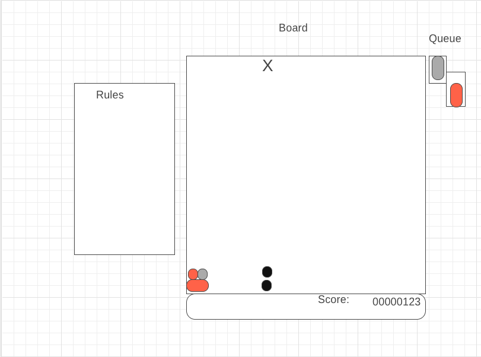

# Puyo Drop

## Background and overview
Puyo Drop is a game that is similar to tetris. Groups of colored blocks, or puyo will drop down from the top of the screen and fall until it hits the bottom of the screen, or another puyo. The player loses when any puyo touches the top of the screen of the third row from the left.

## Functionality and MVP Features
- User can press the directional arrow keys to move the puyos left and right and also have it drop down quickly.
- Game ends if the puyos reach the top of the board
- If 4 or more puyos of the same color touch they are removed from the game.
- After puyos are removed the puyos that were on top of the removed puyos start falling

## Wireframes

## Architecture and Technologies
- Vanilla Javascript for the game logic.
- Webpack to bundle all javascript files into one bigger javascript file that is more easily importable

## Implementation Timeline
Day 1:  
- Review Canvas material on AA Online
- Draw the board
- Write the logic for the board.

Day 2:
- Write the logic for losing and having puyos fall.
- Write the logic for having puyos clear

Day 3:
- Write logic for puyos falling after a clear until there are no more possible clears.
- Show the next two puyos in queue

Day 4:
- Write logic for the speed increases as level increases
- Show the score

Day 5:
- Add sprites

### Sprites from 
https://www.spriters-resource.com/wii/puyo20th/sheet/47990/
